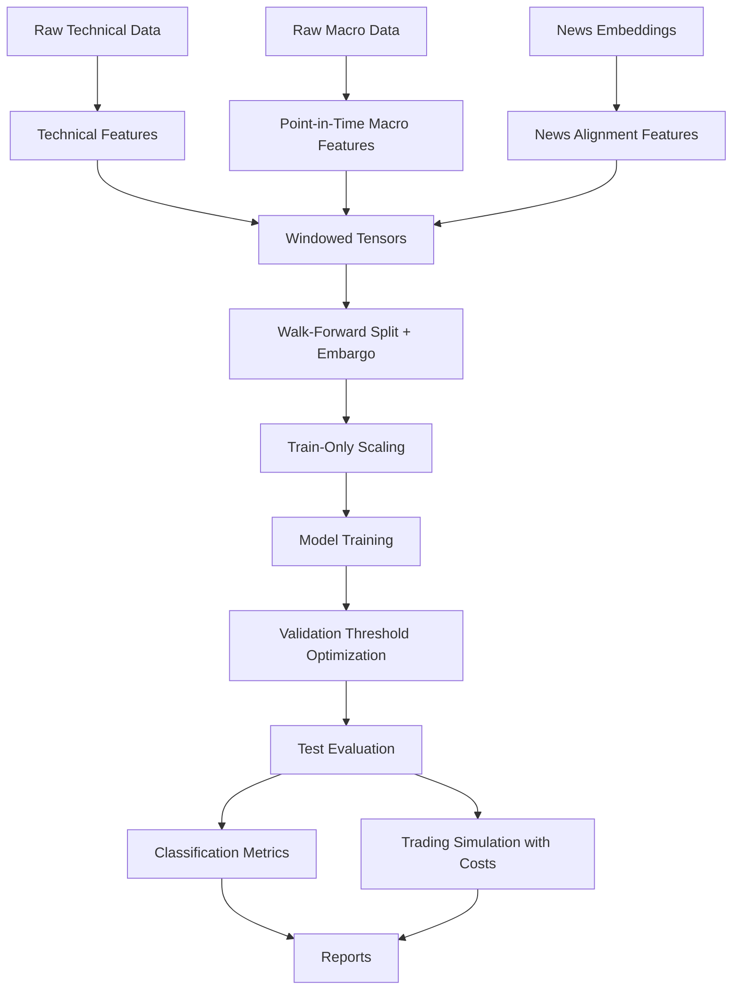

# MSDL-JCI — Multi-Source Deep Learning for JCI Direction Prediction

Predicting Indonesia Composite Index (t+5) direction from technical, macroeconomic, and news modalities — closed as a rigorous, leak-free **negative result**.

```text
Research Status: Closed.
Proposed Adaptive Soft Gating: Not viable.
Best research baseline: LSTM + Macro.
Strongest simple heuristic: Momentum-5d.
Deployment Status: Research/thesis defense only. Not for live trading.
```

## Executive summary

- **Built:** leak-free multimodal pipeline (point-in-time alignment, train-only scaling, embargoed walk-forward, validation-only thresholds, cost-aware trading sim).
- **Tested:** 5 neural models + 9 statistical/ML baselines, 2 folds × 3 seeds, Wilcoxon/t-test + bootstrap statistics. All tests pass.
- **Failed:** the proposed Adaptive Soft Gating model collapsed (near-constant probabilities, MCC ≈ 0); branch probes showed AUC ≈ 0.50 per modality; gating fixes balanced weights but not signal.
- **Learned:** the bottleneck is data signal (stale macro, sparse news, weak technical edge at t+5), not engineering.
- **Useful:** evaluation methodology, diagnostic suite, and honest negative evidence. LSTM + Macro retained as research baseline only; nothing is deployable.

## Key results

| Item | Finding | Evidence |
|---|---:|---|
| Tests | All pass | pytest |
| Proposed model | Not viable | MCC near zero, probability collapse |
| Branch-only AUC | ~0.50 | branch probes |
| Gating fixes | Stabilized weights but not signal | entropy improved, MCC unchanged |
| LSTM + Macro | Research baseline only | mean AUC ~0.588, not significant |
| Momentum-5d | Strongest heuristic | net ~28.07, Sharpe ~1.31, exposure ~55% |

Statistical significance is **not** claimed where tests were null (all p > 0.05).

## Architecture



Module map: `src/msdl_jci/` — see `docs/02_architecture.md`.

## Repository structure

```text
MSDL-JCI/
├─ .github/workflows/ci.yml    # CI pipeline
├─ configs/                    # frozen thesis settings + overrides
├─ data/                       # raw (git-ignored) / processed / sample / schemas
├─ docs/                       # 01–11 defense documentation
├─ notebooks/                  # thesis_defense.ipynb (visualization)
├─ reports/                    # phase_00 … phase_11 + final_recommendation.md
├─ scripts/                    # essential runners only
├─ src/msdl_jci/               # package (models, evaluation, training, experiments)
├─ tests/                      # unit / integration
├─ artifacts/                  # large outputs (not committed)
├─ Makefile Dockerfile pyproject.toml uv.lock requirements.txt
├─ README.md
```

## Quickstart

```bash
uv sync
uv run pytest -v
uv run msdl-jci --mode proposed --epochs 40
uv run python -m msdl_jci.experiments.run_ablation
```

Fallback (no uv):

```bash
python -m venv .venv
source .venv/bin/activate  # Windows: .venv\Scripts\activate
pip install -e ".[dev]"
pytest -v
python -m msdl_jci.main --mode proposed --epochs 40
```

See `make` targets (`install lint format type test smoke run-proposed run-ablation clean`).

### Environment notes
- Some audit runs used `PYTHONPATH=src python3 ...` because `uv` was unavailable in a Linux shell over a Windows-built `.venv` — same code, same seed (42).
- Recreate `.venv` locally; the committed one (if present) is not portable.

## Data requirements

```text
data/raw/technical/jci_historical.csv
data/raw/macro/bi_rate.csv
data/raw/macro/inflation_data.csv
data/raw/macro/kurs_usdidr.csv
data/processed/daily_news_embeddings.csv
```

Schemas, formats, missing-data rules, and point-in-time assumptions: `data/schemas/columns.md`, `docs/03_data_pipeline.md`. CI uses `data/sample/aligned_sample.csv` (raw data is git-ignored).

## Experiment reports

`docs/07_reports_index.md` maps all phases: phase_00_baseline · phase_01_collapse · phase_02_branch_diagnosis · phase_03_gating · phase_04_macro · phase_05_news · phase_06_training_dynamics · phase_07_objective_threshold · phase_08_baselines · phase_09_robust_validation · phase_10_trading · phase_11_experiments · `reports/final_recommendation.md`.

## Thesis defense notebook

`notebooks/app.ipynb` — visualizes architecture, training dynamics (loss curves, hyperparameter sweeps), classification results, gating weight analysis, trading simulation, and equity curves. Run with Jupyter to reproduce all defense figures.

## Limitations and risks

Not investment advice; not live-trading ready; historical simulation only. Cost assumptions may change results; macro release-date and news-timing assumptions are imperfect; small, non-stationary sample. Full list: `docs/09_limitations_and_risks.md`.

## License and citation

MIT — see `LICENSE`. Cite via `CITATION.cff`. Thesis narrative: `docs/10_thesis_defense.md`.
