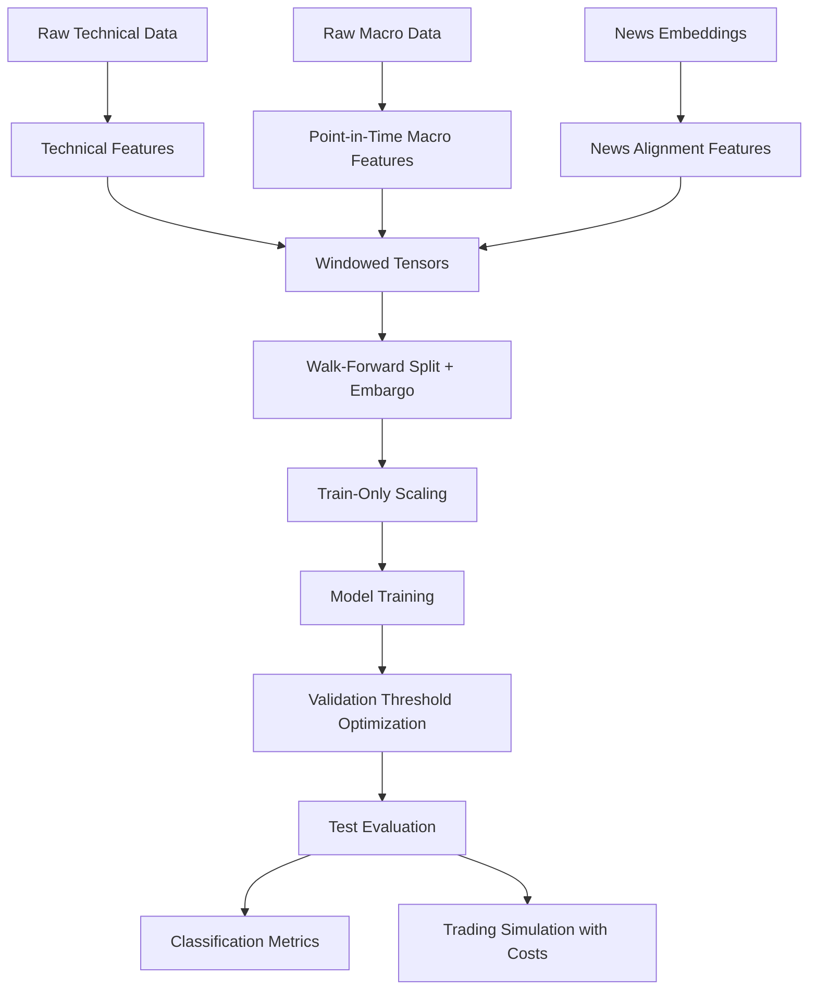

# MSDL-JCI — Multi-Source Deep Learning for JCI Direction Prediction

Predicting Indonesia Composite Index (t+5) direction from technical, macroeconomic, and news modalities — closed as a rigorous, leak-free **negative result**.

```text
Research Status: Closed.
Proposed Adaptive Soft Gating: Not viable.
Best research baseline: LSTM + Macro.
Strongest simple heuristic: Momentum-5d.
Deployment Status: Research/thesis defense only. Not for live trading.
```

## Executive summary

- **Built:** leak-free multimodal pipeline (point-in-time alignment, train-only scaling, embargoed walk-forward, validation-only thresholds, cost-aware trading sim).
- **Tested:** 5 neural models + 9 statistical/ML baselines, 2 folds × 3 seeds, Wilcoxon/t-test + bootstrap statistics.
- **Failed:** the proposed Adaptive Soft Gating model collapsed (near-constant probabilities, MCC ≈ 0); branch probes showed AUC ≈ 0.50 per modality; gating fixes balanced weights but not signal.
- **Learned:** the bottleneck is data signal (stale macro, sparse news, weak technical edge at t+5), not engineering.
- **Useful:** evaluation methodology, diagnostic suite, and honest negative evidence. LSTM + Macro retained as research baseline only; nothing is deployable.

> Branch note (`refactor`): this branch is a mid-migration simplification. The test suite is currently RED (config refactor gap — see AGENTS.md) and no `data/` ships with it. Nothing here runs end-to-end yet.

## Key results

| Item | Finding | Evidence |
|---|---:|---|
| Proposed model | Not viable | MCC near zero, probability collapse |
| Branch-only AUC | ~0.50 | branch probes |
| Gating fixes | Stabilized weights but not signal | entropy improved, MCC unchanged |
| LSTM + Macro | Research baseline only | mean AUC ~0.588, not significant |
| Momentum-5d | Strongest heuristic | net ~28.07, Sharpe ~1.31, exposure ~55% |

Statistical significance is **not** claimed where tests were null (all p > 0.05).

## Architecture



## Repository structure

```text
MSDL-JCI/
├─ .github/workflows/ci.yml    # CI pipeline (uv sync, advisory ruff, non-blocking mypy, pytest)
├─ notebooks/                  # development.ipynb (runnable synthetic demo)
├─ src/msdl_jci/               # package (config, models, evaluation, experiments, utils)
├─ tests/                      # unit / integration (synthetic, no data files)
├─ pyproject.toml uv.lock .python-version
├─ AGENTS.md README.md
```

Shipped without: raw/processed data, `docs/`, `reports/`, `scripts/`, `configs/`, `Makefile`, `Dockerfile`. See AGENTS.md for what is actually on disk.

## Quickstart

```bash
uv sync --extra dev
uv run pytest -q
uv run msdl-jci --mode proposed --epochs 40
uv run msdl-jci-ablation
```

Fallback (no uv):

```bash
python -m venv .venv
source .venv/bin/activate  # Windows: .venv\Scripts\activate
pip install -e .
pytest -q
python -m msdl_jci.main --mode proposed --epochs 40
```

`uv.lock` is the single source of truth for dependencies. Lint (`ruff`) and typecheck (`mypy`) come from the `dev` extra, so plain `uv sync` won't put them on PATH.

## Data requirements

No data ships on this branch. A full run expects (not present):

```text
data/raw/jci_historical.csv
data/raw/bi_rate.csv
data/raw/inflation_data.csv
data/raw/kurs_usdidr.csv
data/processed/daily_news_embeddings.csv   # 768-d IndoBERT vectors
```

When the news embedding file is absent, the builder substitutes all-zero news vectors, so the news modality carries no signal. Tests are fully synthetic (generated in-code) and need no data files.

## Dev notebook

`notebooks/development.ipynb` — self-contained runnable demo of the builder logic on synthetic data: causal technical indicators, point-in-time ffill macro alignment, t+5 labeling, train-only scaler fitting (`train_end_idx`), and windowed tensor construction. Execute with:

```bash
uv run jupyter execute notebooks/development.ipynb --inplace
```

`notebooks/01_data_alignment_example.ipynb` and `notebooks/app.ipynb` are stale on this branch — they read `data/raw/` and `reports/`/`data/processed/`, which do not exist here.

## Limitations and risks

Not investment advice; not live-trading ready; historical simulation only. Cost assumptions may change results; macro release-date and news-timing assumptions are imperfect; small, non-stationary sample.

## License

MIT.
